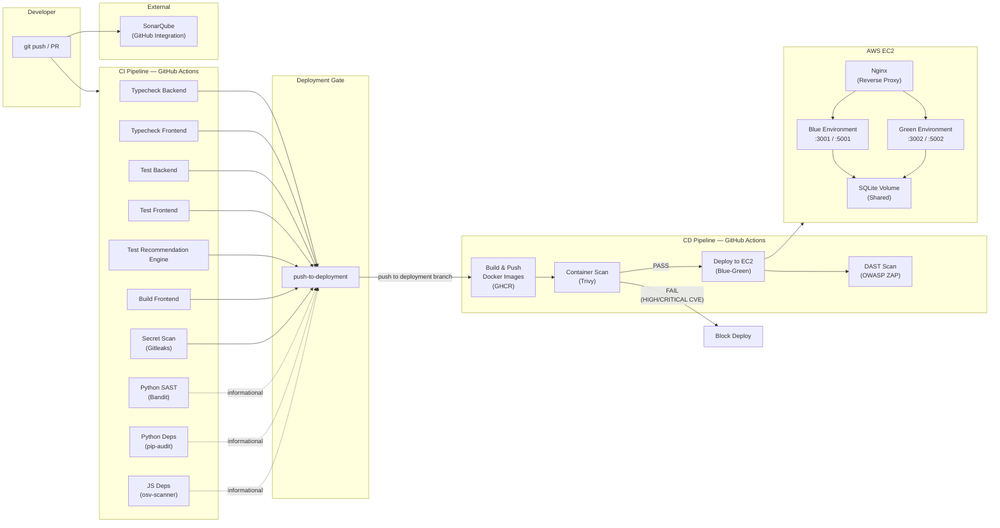
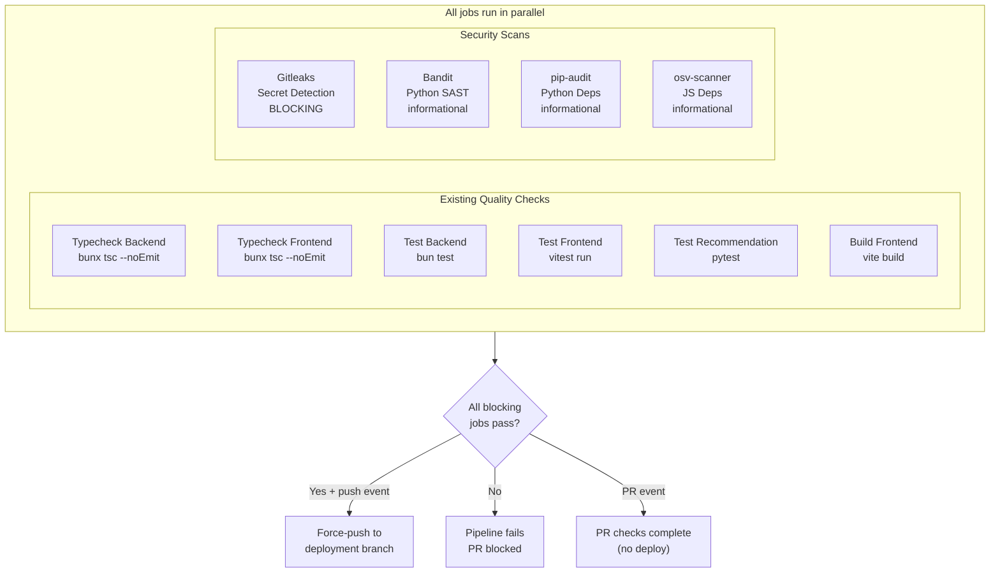
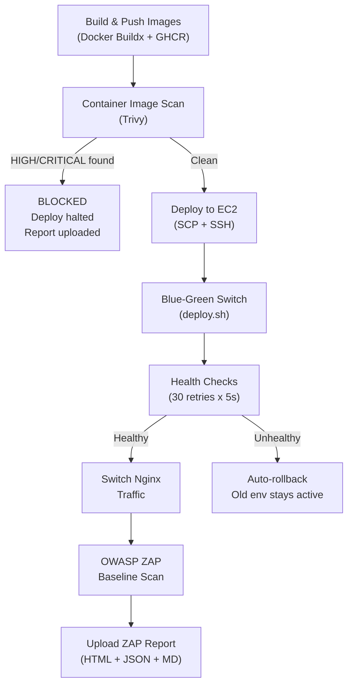
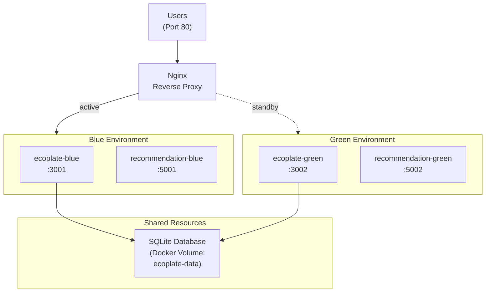

<!-- NOSONAR -->
# EcoPlate DevSecOps Architecture

## Toolchain Overview

| Layer | Tool | Purpose |
|-------|------|---------|
| Source Control | GitHub | Repository hosting, branch protection |
| Code Quality | SonarQube | Code smells, bugs, vulnerabilities, coverage |
| Secret Scanning | Gitleaks | Detects leaked credentials in git history |
| SAST (JS/TS) | SonarQube | Static analysis for TypeScript/React code |
| SAST (Python) | Bandit | Static analysis for Flask recommendation engine |
| Dependency Audit (JS) | osv-scanner | Known CVEs in npm packages |
| Dependency Audit (Python) | pip-audit | Known CVEs in PyPI packages |
| Container Scanning | Trivy | CVEs in Docker images (OS packages + deps) |
| DAST | OWASP ZAP | Baseline scan against live deployment |
| CI/CD | GitHub Actions | Automated pipeline orchestration |
| Container Registry | GitHub Container Registry (GHCR) | Docker image storage |
| Deployment | Docker + Blue-Green | Zero-downtime deployment on AWS EC2 |
| Reverse Proxy | Nginx | Rate limiting, security headers, traffic switching |

---

## Pipeline Architecture Diagram



---

## CI Pipeline Detail (ci.yml)

Triggers on: **push to main** or **pull request to main**



**Blocking jobs** (must pass to deploy): Typecheck Backend, Typecheck Frontend, Test Backend, Test Frontend, Test Recommendation, Build Frontend, Secret Scan (Gitleaks).

**Informational jobs** (produce reports, do not block): Bandit, pip-audit, osv-scanner.

All security scan results are uploaded as **GitHub Actions artifacts** (30-day retention).

---

## CD Pipeline Detail (cd.yml)

Triggers on: **push to deployment branch** (auto-triggered by CI)



### Docker Images

| Image | Registry | Tags |
|-------|----------|------|
| `ecoplate-app` | `ghcr.io/{owner}/ecoplate-app` | `:{commit-sha}`, `:latest` |
| `ecoplate-recommendation` | `ghcr.io/{owner}/ecoplate-recommendation` | `:{commit-sha}`, `:latest` |

### Trivy Scan Policy

- **Severity:** HIGH and CRITICAL only
- **Action on finding:** Fail pipeline, block deployment
- **Reports:** Uploaded as text artifacts

### ZAP Scan Policy

- **Type:** Passive baseline scan
- **Action on finding:** Non-blocking (continue-on-error)
- **Reports:** HTML, JSON, and Markdown uploaded as artifacts

---

## Blue-Green Deployment Architecture



### Deployment Flow

1. Pull new Docker images by commit SHA
2. Stop the **inactive** environment (the one not serving traffic)
3. Start the inactive environment with new images
4. Health check recommendation engine, then app (30 retries x 5s = 150s max)
5. On success: switch Nginx upstream to new environment
6. On failure: stop new environment, old environment untouched
7. Old environment kept running as instant rollback target

### Rollback

```bash
ssh ec2-user@<EC2_HOST>
bash /ecoplate/deploy/deploy.sh rollback
```

Verifies the previous environment is healthy, switches Nginx back, updates state file.

---

## Nginx Security Configuration

### Headers

| Header | Value | Purpose |
|--------|-------|---------|
| `X-Frame-Options` | `SAMEORIGIN` | Prevent clickjacking |
| `X-Content-Type-Options` | `nosniff` | Prevent MIME sniffing |
| `X-XSS-Protection` | `1; mode=block` | XSS filter |
| `Referrer-Policy` | `strict-origin-when-cross-origin` | Control referrer leakage |
| `Content-Security-Policy` | `default-src 'self'; ...` | Restrict resource loading origins |
| `Permissions-Policy` | `camera=(self), geolocation=(self), ...` | Control browser API access |
| `server_tokens` | `off` | Hide Nginx version |

### Rate Limiting

- Zone: `api` (10MB shared memory)
- Rate: 30 requests/second per IP
- Burst: 50 requests (no delay)
- Applied to: `/api/*` endpoints

### Content Security Policy Breakdown

| Directive | Value | Reason |
|-----------|-------|--------|
| `default-src` | `'self'` | Restrict all resources to same origin |
| `script-src` | `'self' https://maps.googleapis.com` | App scripts + Google Maps SDK |
| `style-src` | `'self' 'unsafe-inline' https://fonts.googleapis.com` | Tailwind CSS requires inline styles |
| `img-src` | `'self' data: blob: https://*.googleapis.com https://*.gstatic.com` | Camera uploads (blob/data) + Maps tiles |
| `font-src` | `'self' https://fonts.gstatic.com` | Local fonts + Google Fonts |
| `connect-src` | `'self' ws: wss: https://maps.googleapis.com` | API calls + WebSocket + Maps |
| `frame-ancestors` | `'self'` | Prevent embedding in iframes |

---

## SonarQube Integration

- **Integration method:** GitHub App (automatic PR analysis)
- **Quality gate:** Sonar way (default)
- **Configuration file:** `sonar-project.properties` at repo root
- **Sources scanned:** `backend/src/`, `frontend/src/`, `recommendation-engine/`
- **Exclusions:** `node_modules/`, `dist/`, shadcn/ui components, migrations, config files

### Sonar Way Quality Gate Conditions (New Code)

| Condition | Threshold |
|-----------|-----------|
| New bugs | 0 |
| New vulnerabilities | 0 |
| Security hotspots reviewed | 100% |
| Duplicated lines | < 3% |
| Coverage (if configured) | >= 80% |

---

## Security Scan Report Artifacts

Every pipeline run produces downloadable artifacts in the GitHub Actions run:

| Artifact | Tool | Format | Retention |
|----------|------|--------|-----------|
| `gitleaks-report` | Gitleaks | SARIF | 30 days |
| `bandit-report` | Bandit | JSON | 30 days |
| `pip-audit-report` | pip-audit | JSON | 30 days |
| `js-audit-reports` | osv-scanner | JSON | 30 days |
| `trivy-reports` | Trivy | Text (table) | 30 days |
| `zap-report` | OWASP ZAP | HTML + JSON + MD | 30 days |

---

## Secrets Management

| Secret | Used By | Purpose |
|--------|---------|---------|
| `GITHUB_TOKEN` | CI/CD | Built-in, GHCR login + Gitleaks |
| `EC2_HOST` | CD | Deployment target IP |
| `EC2_USER` | CD | SSH username for EC2 |
| `EC2_SSH_KEY` | CD | SSH private key for EC2 |
| `GHCR_DEPLOY_USER` | CD | GHCR login on EC2 |
| `GHCR_DEPLOY_TOKEN` | CD | GHCR pull token on EC2 |

All secrets stored in **GitHub Actions Secrets** (encrypted at rest, masked in logs). No secrets are hardcoded in source code or Docker images.
