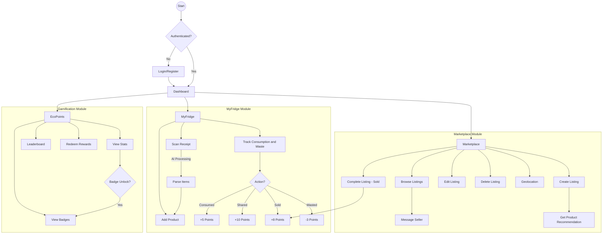
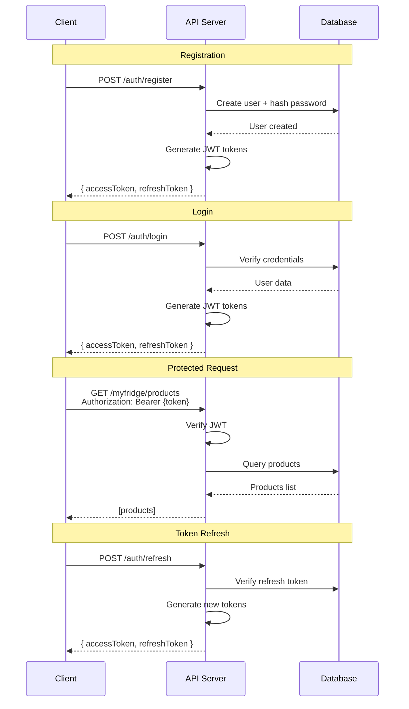
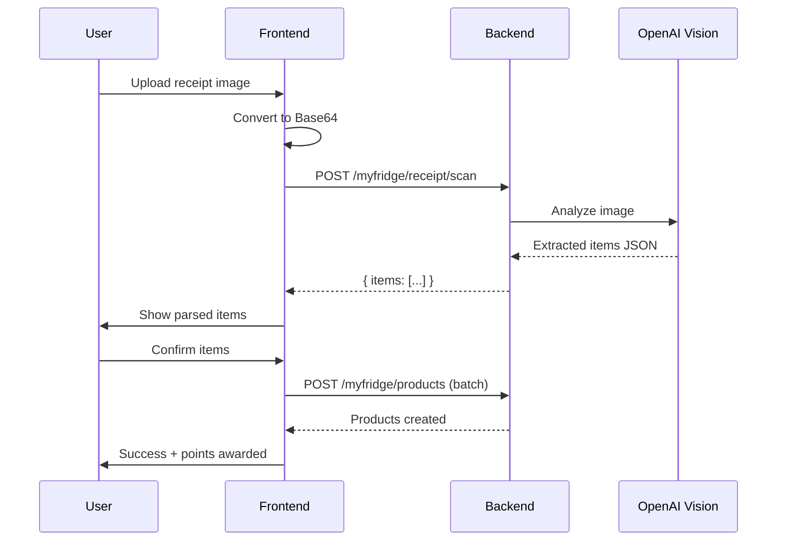

# EcoPlate

> A full-stack sustainability platform that reduces household food waste through AI-powered inventory tracking, a peer-to-peer marketplace, and a gamified reward system.

EcoPlate transforms how households manage food consumption by combining **OpenAI Vision receipt scanning**, **ML price recommendations**, **real-time WebSocket messaging**, and a **CO2 gamification engine**, turning sustainable actions into points, badges, and leaderboard achievements.

Built with **React 19**, **TypeScript**, **Bun**, **SQLite (Drizzle ORM)**, **Capacitor (Android/iOS)**, and **Tailwind CSS + shadcn/ui**. 

Production web (only for the month of Feb): 18.143.173.20

## System Architecture


## Screenshots

| Messaging (WebSockets) | Consumption Tracking |
|:-:|:-:|
|  |  |

| Dashboard | Marketplace |
|:-:|:-:|
|  |  |

| EcoPoints & Rewards |
|:-:|
|  |

## Key Features

### MyFridge: AI Powered Inventory Management
- Track food items with expiration dates and CO2 emission data
- **Receipt scanning** via OpenAI Vision: snap a photo, items are parsed and added automatically
- Log consumption, waste, sharing, and sales with sustainability metrics per action

### Marketplace: Peer to Peer Food Redistribution
- List near expiry food items for sale or free pickup
- Browse listings with geolocation based map view
- **ML powered price recommendations** for optimal listing pricing
- **Real time in app messaging** between buyers and sellers via WebSockets
- Complete transactions to earn EcoPoints tied to CO2 savings

### EcoPoints & Badges: Gamification Engine
- Earn points calculated from **CO2 savings** (CO2 value x 1.5, minimum 3 points per action)
- **16 unlockable badges** across 4 categories: Milestones, Waste Reduction, Sharing, and Streaks
- Daily streak tracking with milestone notifications (3, 7, 14, 30 days and beyond)
- Community leaderboard ranked by lifetime points
- Redeem points for rewards

## Tech Stack

| Layer | Technology |
|---|---|
| **Runtime** | [Bun](https://bun.sh) |
| **Database** | SQLite via `bun:sqlite` |
| **ORM** | [Drizzle ORM](https://orm.drizzle.team) |
| **Backend** | Bun native HTTP server + WebSockets |
| **Frontend** | React 19 + TypeScript |
| **Build Tool** | [Vite](https://vitejs.dev) |
| **Styling** | [Tailwind CSS](https://tailwindcss.com) + [shadcn/ui](https://ui.shadcn.com) |
| **Mobile** | [Capacitor](https://capacitorjs.com) (Android & iOS) |
| **AI/ML** | OpenAI Vision API, Python recommendation engine |
| **Auth** | JWT (jose library) |
| **Validation** | [Zod](https://zod.dev) |

## User Flow



## Database Schema


## API Endpoints

### Authentication
| Method | Endpoint | Description |
|--------|----------|-------------|
| POST | `/api/v1/auth/register` | Register new user |
| POST | `/api/v1/auth/login` | Login |
| POST | `/api/v1/auth/refresh` | Refresh access token |
| POST | `/api/v1/auth/logout` | Logout |

### MyFridge
| Method | Endpoint | Description |
|--------|----------|-------------|
| GET | `/api/v1/myfridge/products` | List all products |
| POST | `/api/v1/myfridge/products` | Add product |
| GET | `/api/v1/myfridge/products/:id` | Get product |
| PATCH | `/api/v1/myfridge/products/:id` | Update product |
| DELETE | `/api/v1/myfridge/products/:id` | Delete product |
| POST | `/api/v1/myfridge/products/:id/consume` | Log consumption |
| POST | `/api/v1/myfridge/receipt/scan` | Scan receipt (AI) |

### Marketplace
| Method | Endpoint | Description |
|--------|----------|-------------|
| GET | `/api/v1/marketplace/listings` | Browse active listings |
| GET | `/api/v1/marketplace/listings/nearby` | Get nearby listings (geolocation) |
| GET | `/api/v1/marketplace/my-listings` | Get user's own listings |
| GET | `/api/v1/marketplace/listings/:id` | Get listing details |
| POST | `/api/v1/marketplace/listings` | Create new listing |
| PATCH | `/api/v1/marketplace/listings/:id` | Update listing |
| DELETE | `/api/v1/marketplace/listings/:id` | Delete listing |
| POST | `/api/v1/marketplace/listings/:id/complete` | Mark as sold/completed |

### Gamification
| Method | Endpoint | Description |
|--------|----------|-------------|
| GET | `/api/v1/gamification/dashboard` | Dashboard summary |
| GET | `/api/v1/gamification/points` | Points breakdown & history |
| GET | `/api/v1/gamification/badges` | All badges with progress |
| GET | `/api/v1/gamification/metrics` | Sustainability metrics |
| GET | `/api/v1/gamification/leaderboard` | Community leaderboard |

## Authentication Flow



## Receipt Scanning Flow



## Project Structure

```
ecoplate/
├── backend/
│   ├── src/
│   │   ├── index.ts              # Server entry point
│   │   ├── routes/               # API route handlers
│   │   │   ├── auth.ts           # Authentication
│   │   │   ├── myfridge.ts       # Fridge management
│   │   │   ├── marketplace.ts    # Marketplace
│   │   │   └── gamification.ts   # EcoPoints & Badges
│   │   ├── services/             # Business logic
│   │   │   ├── gamification-service.ts
│   │   │   └── badge-service.ts
│   │   ├── middleware/           # Auth middleware
│   │   ├── db/
│   │   │   ├── schema.ts        # Drizzle ORM schema
│   │   │   ├── migrations/      # Database migrations
│   │   │   └── seed.ts          # Seed data
│   │   └── utils/
│   └── public/                  # Built frontend assets
├── frontend/
│   ├── src/
│   │   ├── components/          # React components
│   │   ├── pages/               # Page components
│   │   ├── contexts/            # React contexts
│   │   ├── services/            # API client + Capacitor utils
│   │   ├── hooks/               # Custom hooks
│   │   └── lib/                 # Utilities
│   ├── android/                 # Android native project
│   └── capacitor.config.ts      # Capacitor config
├── recommendation-engine/
│   ├── app.py                   # ML recommendation service
│   ├── Dockerfile               # Container deployment
│   └── requirements.txt         # Python dependencies
└── scripts/                     # Build & deployment scripts
```

## Getting Started

### Prerequisites
- [Bun](https://bun.sh) v1.0+
- (Optional) Android Studio with SDK 33+ for mobile builds

### Quick Start

```bash
# Install dependencies
bun install

# Set up environment
cp .env.example .env

# Run migrations and seed
bun run db:migrate && bun run db:seed

# Start development servers
bun run dev:backend    # Terminal 1 → http://localhost:3000
bun run dev:frontend   # Terminal 2 → http://localhost:5173
```

Or use the convenience scripts:

```bash
# Mac/Linux
./scripts/start-all.sh

# Windows (PowerShell)
.\scripts\start-all.ps1
```

### Production Build

```bash
# Mac/Linux
./scripts/build.sh

# Windows
.\scripts\build.ps1

# Serve
cd backend && bun run src/index.ts  # → http://localhost:3000
```

### Android Build

```bash
./scripts/build-android.sh     # or .\scripts\build-android.ps1
cd frontend && bunx cap open android
```

APK output: `frontend/android/app/build/outputs/apk/debug/app-debug.apk`

> **Note:** Capacitor 6.x + Android Gradle Plugin 9.0+ compatibility patches are applied automatically via `bun install`. See `docs/android-build-patching.md` for details.

## Environment Variables

| Variable | Description | Required |
|----------|-------------|----------|
| `PORT` | Server port (default: 3000) | No |
| `JWT_SECRET` | Secret key for JWT signing | Yes (production) |
| `OPENAI_API_KEY` | OpenAI API key for receipt scanning | No |

## Database

SQLite database stored at `backend/ecoplate.db`:

| Domain | Tables |
|--------|--------|
| **Users** | `users` |
| **MyFridge** | `products`, `product_interaction` |
| **Marketplace** | `marketplace_listings`, `image_listing`, `conversation`, `message` |
| **Gamification** | `user_points`, `badges`, `user_badges`, `product_sustainability_metrics` |

## License

MIT
