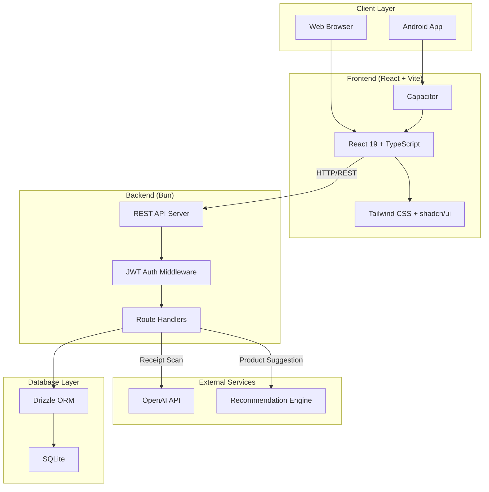
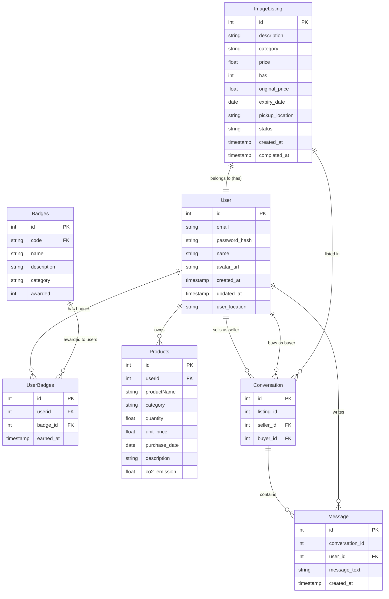

# EcoPlate

EcoPlate is a sustainability-focused food management platform that helps reduce food waste through smart inventory tracking, community marketplace, and gamification. We address the global food waste crisis by transforming how households manage their food consumption, turning sustainability into an engaging, rewarding experience.

Our platform combines AI-powered receipt scanning for effortless food tracking, a peer-to-peer marketplace for redistributing surplus food locally, and a gamified reward system that turns eco-friendly actions into points, badges, and leaderboard achievements. By providing real-time visibility into food inventory, expiration alerts, and CO₂ emission tracking, we empower users to make informed decisions that reduce waste and environmental impact.

EcoPlate goes beyond individual benefits—it builds community-driven sustainability networks where neighbors can share resources, rescue food, and collectively reduce waste. Whether you're scanning grocery receipts, listing near-expiry items, or tracking your environmental savings, every action contributes to a larger movement toward zero-waste living and meaningful climate action.

## System Architecture



## Features

### MyFridge
- Track food items with CO2 emission data
- Scan grocery receipts with AI (OpenAI Vision)
- Log consumption, waste, and extract image data via OpenAI Vision

### Marketplace
- List near-expiry food items for sale or free
- Browse and reserve listings from others
- Complete actions to earn sustainability points
- AI-powered product recommendations
- In-app messaging between buyers and sellers

### EcoBoard & EcoPoints
- Earn points for sustainable actions
- Track streaks and sustainability metrics
- Unlock badges for achievements
- View CO2 savings and waste reduction rate
- Community leaderboard

## User Flow
```mermaid
flowchart TD
    START((Start)) --> AUTH{Authenticated?}
    AUTH -->|No| LOGIN[Login/Register]
    LOGIN --> DASHBOARD
    AUTH -->|Yes| DASHBOARD[Dashboard]

    DASHBOARD --> FRIDGE[MyFridge]
    DASHBOARD --> MARKET[Marketplace]
    DASHBOARD --> ECO[EcoBoard]

    subgraph MyFridge["MyFridge Module"]
       FRIDGE --> ADD[Add Product]
       FRIDGE --> SCAN[Scan Receipt]
       FRIDGE --> VIEW[Track Consumption & Waste]
   
       SCAN -->|AI Processing| PARSE[Parse Items]
       PARSE --> ADD
   
       VIEW --> CONSUME{Action?}
       CONSUME -->|Consumed| POINTS_CONSUMED[+5 Points]
       CONSUME -->|Shared| POINTS_SHARED[+10 Points]
       CONSUME -->|Sold| POINTS_SOLD[+8 Points]
       CONSUME -->|Wasted| POINTS_WASTED[-3 Points]
    end

    end

    subgraph Marketplace["Marketplace Module"]
        MARKET --> BROWSE[Browse Listings]
        MARKET --> CREATE[Create Listing]
        MARKET --> EDIT[Edit Listing]
        MARKET --> Delete[Delete Listing]
        MARKET --> MapView[Geolocation]
        CONTACT --> MESSAGE[Message Seller]
        CREATE --> PRODUCT[Get Product Recommendation]
        
        MARKET --> COMPLETE[Complete Listing (Sold)]
        COMPLETE --> POINTS_SOLD[+8 Points]
    end

    subgraph Gamification["Gamification Module"]
        ECO --> STATS[View Stats]
        ECO --> BADGES[View Badges]
        ECO --> LEADER[Leaderboard]
        POINTS1 & POINTS2 & POINTS3 & POINTS4 --> STATS
        STATS --> UNLOCK{Badge Unlock?}
        UNLOCK -->|Yes| BADGES
    end
```

## Database Schema



## Tech Stack

| Layer | Technology                                                                   |
|-------|------------------------------------------------------------------------------|
| Runtime | [Bun](https://bun.sh)                                                        |
| Database | SQLite (via `bun:sqlite`)                                                    |
| ORM | [Drizzle ORM](https://orm.drizzle.team)                                      |
| Backend | Bun native HTTP server                                                       |
| Frontend | React 19 + TypeScript                                                        |
| Build Tool | [Vite](https://vitejs.dev)                                                   |
| Styling | [Tailwind CSS](https://tailwindcss.com) + [shadcn/ui](https://ui.shadcn.com) |
| Mobile | [Capacitor](https://capacitorjs.com) (iOS & Android)                         |
| Auth | JWT (jose library)                                                           |
| Validation | [Zod](https://zod.dev)                                                       |

## API Authentication Flow


## Receipt Scanning Flow


## Project Structure

```
├── backend/
│   ├── src/
│   │   ├── index.ts           # Main server entry
│   │   ├── routes/            # API route handlers
│   │   │   ├── auth.ts        # Authentication endpoints
│   │   │   ├── myfridge.ts    # Fridge management endpoints
│   │   │   ├── marketplace.ts # Marketplace endpoints
│   │   │   └── gamification.ts# Gamification endpoints
│   │   ├── middleware/        # Auth middleware
│   │   ├── db/
│   │   │   ├── schema.ts      # Drizzle ORM schema
│   │   │   ├── migrations/    # Database migrations
│   │   │   └── seed.ts        # Seed data
│   │   └── utils/             # Utilities
│   ├── public/                # Built frontend assets
│   └── package.json
│   └── .env                  # Web env variables
├── frontend/
│   ├── src/
│   │   ├── components/        # React components
│   │   ├── pages/             # Page components
│   │   ├── contexts/          # React contexts
│   │   ├── services/          # API client + Capacitor utils
│   │   ├── hooks/             # Custom hooks
│   │   └── lib/               # Utilities
│   ├── android/               # Android native project (after cap add)
│   ├── capacitor.config.ts    # Capacitor configuration
│   ├── vite.config.ts
│   └── package.json
│   └── .env.mobile            # Mobile env variables
├── scripts/                   # Start/stop/build scripts
├── package.json               # Root workspace
└── .env.example               # Environment template
├── recommendation-engine/
│   ├── app.py                # Recommendation engine (Flask or FastAPI)
│   ├── Dockerfile            # Dockerfile for deployment
│   └── requirements.txt      # Python dependencies
│   └── .env.ml               # ML env variables
```

## Prerequisites

- [Bun](https://bun.sh) v1.0 or higher

## Quick Start

### Using Scripts

**Windows (PowerShell):**
```powershell
# Start both frontend and backend
.\scripts\start-all.ps1

# Stop all servers
.\scripts\stop-all.ps1
```

**Mac/Linux:**
```bash
# Start both frontend and backend
./scripts/start-all.sh

# Stop all servers
./scripts/stop-all.sh
```

### Manual Setup

1. **Install dependencies:**
   ```bash
   bun install
   ```

2. **Set up environment:**
   ```bash
   cp .env.ml .env.ml
   ```

3. **Run database migrations:**
   ```bash
   bun run db:migrate
   bun run db:seed
   ```

4. **Start development servers:**
   ```bash
   # Terminal 1: Backend
   bun run dev:backend

   # Terminal 2: Frontend
   bun run dev:frontend
   ```

5. **Open the app:**
   - Frontend: http://localhost:5173
   - Backend API: http://localhost:3000

## Production Build

**Windows:**
```powershell
.\scripts\build.ps1
```

**Mac/Linux:**
```bash
./scripts/build.sh
```

Then start the production server:
```bash
cd backend
bun run src/index.ts
```

The server will serve both the API and the built frontend on http://localhost:3000.

## Mobile Apps (Android)

The app uses [Capacitor](https://capacitorjs.com) to build native Android apps.

### Prerequisites

- **Android**: Android Studio with SDK 33+

### Building for Android

**Windows/Mac/Linux:**
```bash
./scripts/build-android.sh
# or on Windows:
.\scripts\build-android.ps1
```

Then open in Android Studio:
```bash
cd frontend && bunx cap open android
```

Or build APK from command line:
```bash
cd frontend/android && ./gradlew assembleDebug
```

APK location: `frontend/android/app/build/outputs/apk/debug/app-debug.apk`

### Known Issues & Fixes

Our project automatically handles Capacitor 6.x + Android Gradle Plugin 9.0+ compatibility. The ProGuard configuration is fixed via:
1. **Gradle build override** (primary) - Configured in `frontend/android/build.gradle`
2. **patch-package** (fallback) - For complex patches
3. **Postinstall script** (safety net) - Runs after `bun install`

**For new team members:** Just run `bun install` and the fixes apply automatically.

**For troubleshooting:** See `docs/android-build-patching.md` for detailed documentation.

### Optional - Building for iOS (macOS only)

```bash
./scripts/build-ios.sh
```

Then open in Xcode:
```bash
cd frontend && bunx cap open ios
```

Or open directly: `frontend/ios/App/App.xcworkspace`

### Mobile Configuration

Edit `frontend/.env.mobile` to set the production API URL:
```
VITE_API_URL=https://api.ecoplate.app/api/v1
```

For development, the app connects to `localhost`. For production builds, update the API URL and rebuild.

### Capacitor Commands

```bash
cd frontend

# Sync web assets to native projects
bun run cap:sync

# Open native IDE
bun run cap:open:ios      # Opens Xcode
bun run cap:open:android  # Opens Android Studio

# Build for mobile
bun run build:mobile      # Build and sync both platforms
bun run build:ios         # Build and copy to iOS
bun run build:android     # Build and copy to Android
```

## Environment Variables

| Variable | Description | Required |
|----------|-------------|----------|
| `PORT` | Server port (default: 3000) | No |
| `JWT_SECRET` | Secret key for JWT signing | Yes (for production) |
| `OPENAI_API_KEY` | OpenAI API key for receipt scanning | No |

## API Endpoints

### Authentication
| Method | Endpoint | Description |
|--------|----------|-------------|
| POST | `/api/v1/auth/register` | Register new user |
| POST | `/api/v1/auth/login` | Login |
| POST | `/api/v1/auth/refresh` | Refresh access token |
| POST | `/api/v1/auth/logout` | Logout |

### MyFridge
| Method | Endpoint | Description |
|--------|----------|-------------|
| GET | `/api/v1/myfridge/products` | List all products |
| POST | `/api/v1/myfridge/products` | Add product |
| GET | `/api/v1/myfridge/products/:id` | Get product |
| PATCH | `/api/v1/myfridge/products/:id` | Update product |
| DELETE | `/api/v1/myfridge/products/:id` | Delete product |
| POST | `/api/v1/myfridge/products/:id/consume` | Log consumption |
| POST | `/api/v1/myfridge/receipt/scan` | Scan receipt (AI) |

### Marketplace
| Method | Endpoint | Description |
|--------|----------|-------------|
| GET | `/api/v1/marketplace/listings` | Browse active listings |
| GET | `/api/v1/marketplace/listings/nearby` | Get nearby map listings |
| GET | `/api/v1/marketplace/my-listings` | Get user's own listings |
| GET | `/api/v1/marketplace/listings/:id` | Get single listing details |
| POST | `/api/v1/marketplace/listings` | Create new listing |
| PATCH | `/api/v1/marketplace/listings/:id` | Update existing listing |
| DELETE | `/api/v1/marketplace/listings/:id` | Delete listing |
| POST | `/api/v1/marketplace/listings/:id/complete` | Mark as sold/completed |

### Gamification
| Method | Endpoint | Description |
|--------|----------|-------------|
| GET | `/api/v1/gamification/dashboard` | Get dashboard data |
| GET | `/api/v1/gamification/points` | Get points details |
| GET | `/api/v1/gamification/badges` | Get all badges |
| GET | `/api/v1/gamification/metrics` | Get sustainability metrics |
| GET | `/api/v1/gamification/leaderboard` | Get leaderboard |

## Scripts Reference

| Script | Description |
|--------|-------------|
| `start-backend.ps1` / `.sh` | Start backend server with dependencies |
| `stop-backend.ps1` / `.sh` | Stop backend server |
| `start-frontend.ps1` / `.sh` | Start frontend dev server with dependencies |
| `stop-frontend.ps1` / `.sh` | Stop frontend dev server |
| `start-all.ps1` / `.sh` | Start all servers (backend, frontend, recommendation) |
| `stop-all.ps1` / `.sh` | Stop all servers |
| `build.ps1` / `.sh` | Build web app for production |
| `build-android.ps1` / `.sh` | Build Android app |
| `build-ios.sh` | Build iOS app (macOS only) |

## Database

The application uses SQLite stored at `backend/ecoplate.db`. The schema includes:

- **Users**: users
- **MyFridge**: products, product_interaction
- **Marketplace**: marketplace_listings, image_listing, conversation, message
- **Gamification**: user_points, badges, user_badges

## License

MIT
