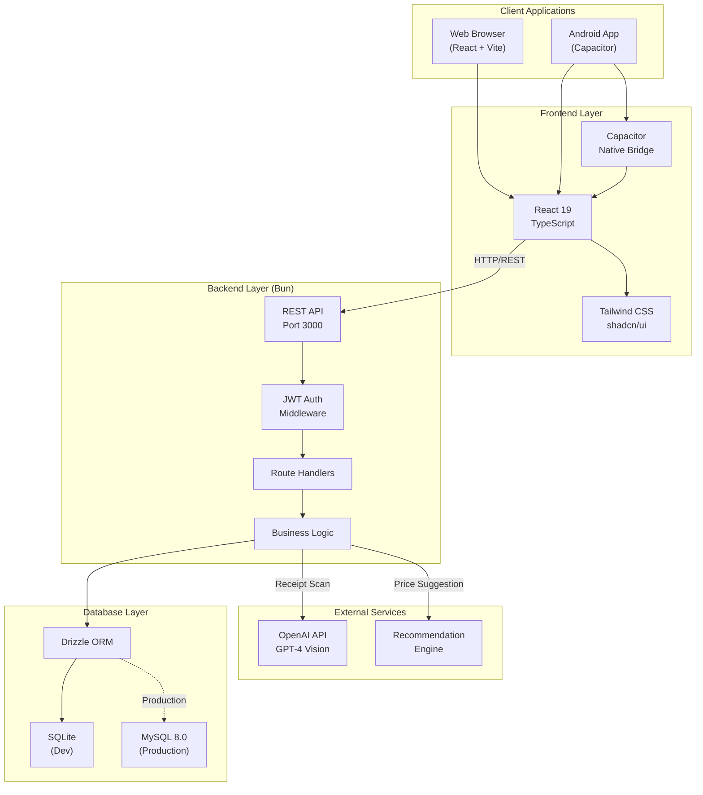
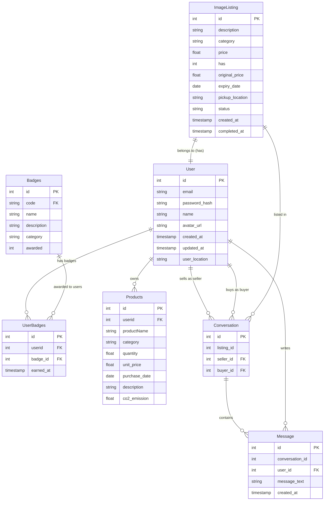
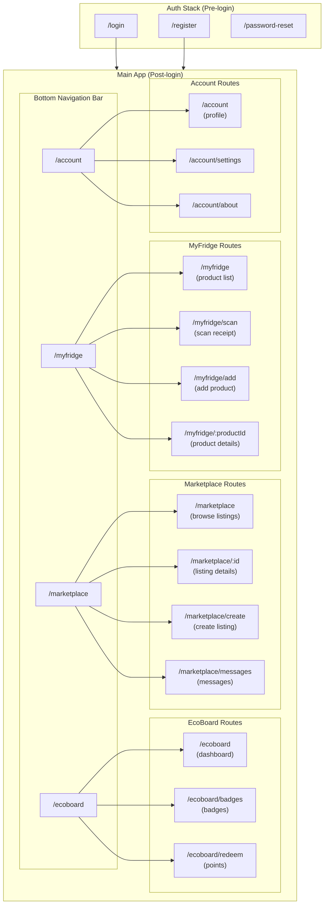
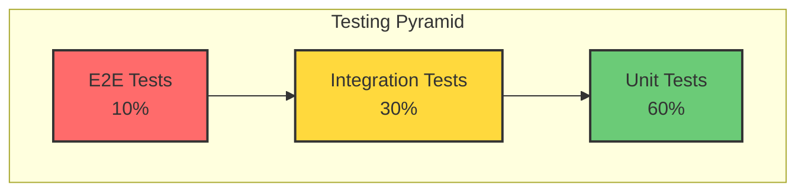
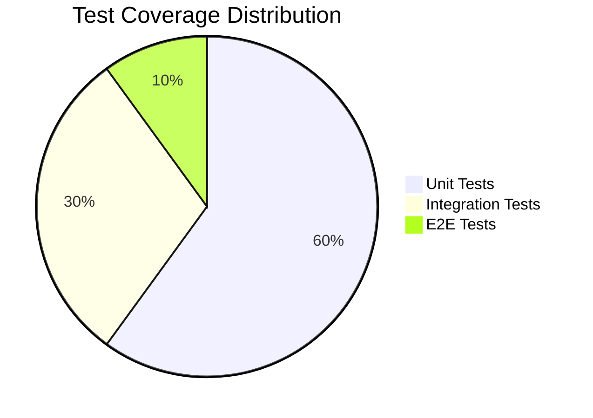

# EcoPlate - Product Requirements Document
## Sprint 1: January 26 - February 1, 2026

---

## 1. Document Overview

**Project Name:** EcoPlate  
**Sprint Number:** Sprint 1  
**Sprint Duration:** January 26 - February 1, 2026 (1 week)  
**Team Size:** 8 Engineers  
**Advisor:** Kenneth Phang  
**Document Version:** 1.0  
**Last Updated:** January 24, 2026

---

## 2. Executive Summary

EcoPlate is a sustainability-focused mobile and web application that combines food inventory management, peer-to-peer marketplace functionality, and gamification to reduce food waste and promote sustainable consumption habits. Sprint 1 focuses on establishing the technical foundation through database design, logical data modeling, and initial software prototypes for all three major feature packages.

**Sprint 1 Goal:** Establish the technical architecture and deliver working prototypes for MyFridge, Marketplace, and Sustainability Gamification modules.

---

## 3. Sprint 1 Objectives & Story Points

| Objective | Story Points | Owner(s) |
|-----------|--------------|----------|
| Sprint Backlog Refinement | 2 | Glenn (Scrum Master) |
| Database Design | 4 | All Team |
| Logical Data Model | 4 | All Team |
| Software Prototypes | 3 | Feature Teams |
| **Total** | **13** | |

---

## 4. Team Structure & Assignments

### 4.1 Feature Teams

| Feature Package | Engineers                           | Primary Responsibilities |
|-----------------|-------------------------------------|--------------------------|
| **MyFridge** | Nithvin, Aung Kyaw Kyaw             | Receipt scanning, inventory management, consumption tracking |
| **Marketplace** | Glenn, Thae Thae Hsu                | Product listings, messaging, price recommendations |
| **Sustainability Gamification** | Yong Hui, Song Jiaqi, Zhou Jiasheng | Dashboards, points system, badges, achievements |
| **Infrastructure & DevOps** | TBC                                 | Database setup, API architecture, CI/CD |

### 4.2 Cross-Functional Roles

- **Scrum Master / UI Lead:** Glenn Min
- **Backend Architecture Lead:** Tek Sheng Qi
- **Frontend Lead:** Nithvin
- **Database Lead:** Aung Kyaw Kyaw

---

## 5. Technical Stack

### 5.1 System Architecture Overview



### 5.2 Technology Specifications

| Layer | Technology | Purpose |
|-------|------------|---------|
| **Frontend** | React Native | Cross-platform mobile (Android) + Web |
| **Backend** | Bun | High-performance JavaScript runtime |
| **Database** | MySQL 8.0+ | Relational data storage |
| **LLM** | OpenAI GPT-4 | Receipt extraction, recommendations |
| **ML** | Custom Recommender System | Product recommendations, price suggestions |
| **Authentication** | JWT + OAuth 2.0 | User authentication & authorization |

### 5.2 Development Environment Setup

**Required by Sprint 1 Day 1:**
- Node.js 18+ and Bun runtime installed
- MySQL 8.0 local instances
- React development environment with Vite
- Capacitor CLI installed for mobile builds
- OpenAI API keys (sandbox environment)
- Git repository structure established
- CI/CD pipeline skeleton (GitHub Actions)

---

## 6. Feature Requirements - Sprint 1

> **Note:** Detailed use cases for each module are documented in separate files for better organization and maintainability.

### 6.1 MyFridge Module (Nithvin, Aung Kyaw Kyaw)

📄 **Full Use Case Documentation:** [myfridge-use-cases.md](use-cases/myfridge-use-cases.md)

**Use Cases Overview:**
- UC-MF-001: Scan Receipt
- UC-MF-002: Add Product to List
- UC-MF-003: View MyFridge Products
- UC-MF-004: Track Consumption & Waste
- UC-MF-005: Sell MyFridge Product

**Sprint 1 Key Deliverables:**
- Receipt scanning with OpenAI Vision API integration
- Product CRUD operations
- Expiry date tracking with warnings
- Consumption/waste logging

---

### 6.2 Marketplace Module (Glenn, Thae Thae Hsu)

📄 **Full Use Case Documentation:** [marketplace-use-cases.md](use-cases/marketplace-use-cases.md)

**Use Cases Overview:**
- UC-MP-001: Search Products
- UC-MP-002: Filter Products
- UC-MP-003: View Product Listing
- UC-MP-004: Create Product Listing
- UC-MP-005: Update/Delete Product Listing
- UC-MP-006: Send/Receive Messages
- UC-MP-007: Receive Product Recommendation

**Sprint 1 Key Deliverables:**
- Marketplace browse/search with filters (title, category)
- Location-based browsing with geolocation and radius filtering
- Listing CRUD operations (create, read, update, delete)
- User-specific listings view (`/my-listings`)
- Mark listings as completed/sold
- Basic messaging system (conversation creation and message sending)

---

### 6.3 Sustainability Gamification Module (Yong Hui, Song Jiaqi, Zhou Jiasheng)

📄 **Full Use Case Documentation:** [gamification-use-cases.md](use-cases/gamification-use-cases.md)

**Use Cases Overview:**
- UC-GF-001: View CO2 Emission Saved Dashboard
- UC-GF-002: View CO2 Emission Wasted Dashboard
- UC-GF-003: View Food Consumption % Dashboard
- UC-GF-004: View Money Saved Dashboard
- UC-GF-005: Collect Points
- UC-GF-006: Redeem Points
- UC-GF-007: View Achievement Badges
- UC-GF-008: Share Achievement Badge
- UC-GF-009: Generate Badge (System)
- UC-GF-010: Generate Points (System)

**Sprint 1 Key Deliverables:**
- 4-panel EcoBoard dashboard
- Points system with transactions
- Badge unlock system
- Sustainability metrics tracking

---

### 6.4 Authentication & Account Module (Shared Responsibility)

📄 **Full Use Case Documentation:** [auth-use-cases.md](use-cases/auth-use-cases.md)

**Use Cases Overview:**
- UC-AU-001: Register User
- UC-AU-002: Login User
- UC-AU-003: Reset Password
- UC-AU-004: Update User Profile
- UC-AU-005: Modify Notification Settings

**Sprint 1 Key Deliverables:**
- JWT-based authentication
- User registration and login
- Password reset flow
- Profile management

---

## 7. Database Design - Sprint 1

### 7.1 Entity-Relationship Diagram


### 7.2 Database Performance Considerations

**Indexing Strategy:**
- Primary keys: UUID with indexed B-tree
- Foreign keys: All indexed for join performance
- Geospatial index on `marketplace_listings.pickup_location` for location-based queries
- Composite index on `(user_id, created_at)` for time-series queries
- Full-text search index on `marketplace_listings.title` and `description` (to be implemented in Sprint 2)

**Data Volume Estimates (End of Project - 4 weeks):**
- Users: ~100-200 (test users + team)
- Products: ~500-1000
- Marketplace listings: ~200-400
- Messages: ~500-1000
- Point transactions: ~2000-5000

**Query Optimization Targets:**
- Dashboard metrics queries: <500ms
- Marketplace search: <2s
- Product listing retrieval: <200ms
- Real-time messaging: <100ms latency

### 7.3 Data Migration & Seeding Plan

**Sprint 1 Tasks:**
1. **Day 1-2:** Schema creation scripts
2. **Day 3:** Seed data generation for testing
   - 50 dummy users
   - 200 dummy products across categories
   - 100 dummy marketplace listings
   - Pre-configured badge definitions
3. **Day 4:** Database connection pooling configuration
4. **Day 5:** Backup & restore procedures documented

---

## 8. API Architecture

### 8.1 RESTful API Design Principles

**Base URL:** `https://api.ecoplate.app/v1`

**Authentication:** 
- Bearer token (JWT) in `Authorization` header
- Public endpoints: `/auth/register`, `/auth/login`, `/marketplace/listings` (browse only)

**Response Format:**
```json
{
  "success": true,
  "data": { /* response payload */ },
  "message": "Operation successful",
  "timestamp": "2026-01-26T10:30:00Z"
}
```

**Error Format:**
```json
{
  "success": false,
  "error": {
    "code": "VALIDATION_ERROR",
    "message": "Invalid input data",
    "details": [
      { "field": "email", "issue": "Invalid email format" }
    ]
  },
  "timestamp": "2026-01-26T10:30:00Z"
}
```

### 8.2 API Versioning Strategy

- Version in URL path: `/v1/`
- Breaking changes trigger new version (v2)
- Deprecated endpoints supported for 2 release cycles

### 8.3 Rate Limiting

**Sprint 1 Targets:**
- Authenticated users: 100 requests/minute
- Unauthenticated: 20 requests/minute
- Implementation: Token bucket algorithm with Redis

---

## 9. Frontend Architecture

### 9.1 React + Capacitor Structure

```
/frontend
  /src
    /components
      /ui             # shadcn/ui components
      /common         # Reusable composite components
      /MyFridge       # MyFridge-specific components
      /Marketplace    # Marketplace-specific components
      /Gamification   # Dashboard/badges components
    /pages
      /auth           # Login, register, password reset
      /MyFridge       # MyFridge pages
      /Marketplace    # Marketplace pages
      /Gamification   # EcoBoard, badges, points
      /Account        # User profile, settings
    /router           # React Router setup
    /services         # API client services
    /store            # State management (Context API / Redux TBD)
    /utils            # Helper functions
    /lib              # shadcn/ui utilities (cn function)
    /constants        # Theme, colors, strings
    /hooks            # Custom React hooks
    /android            # Capacitor Android project
  capacitor.config.ts # Capacitor configuration
  tailwind.config.js  # Tailwind CSS configuration
  components.json     # shadcn/ui configuration
```

### 9.2 State Management Decision

**Options Evaluated:**
1. **React Context API** - Sufficient for MVP, less boilerplate
2. **Redux Toolkit** - Overkill for Sprint 1, consider for Sprint 2+

**Sprint 1 Decision:** Use Context API with the following contexts:
- `AuthContext` - User authentication state
- `MyFridgeContext` - Inventory data
- `MarketplaceContext` - Listings and cart
- `GamificationContext` - Points, badges, metrics

### 9.3 UI Component Library

**Decision:** Use shadcn/ui with Tailwind CSS for responsive components
- **Reason:** Accessible, customizable components; copy-paste approach gives full control; built on Radix UI primitives
- **Styling:** Tailwind CSS for utility-first responsive design
- **Mobile:** Use Capacitor plugins for native device features (camera, notifications, geolocation)

### 9.4 Navigation Structure (React Router)



---

## 10. Machine Learning & AI Integration

### 10.1 OpenAI Integration (Receipt Scanning)

**Use Case:** Extract product information from receipt images

**Implementation Approach:**
```javascript
// Pseudocode
async function scanReceipt(imageBase64) {
  const response = await openai.chat.completions.create({
    model: "gpt-4-vision-preview",
    messages: [
      {
        role: "system",
        content: "Extract product names, quantities, prices, and purchase date from this receipt. Return as JSON array."
      },
      {
        role: "user",
        content: [
          { type: "text", text: "Extract product data:" },
          { type: "image_url", image_url: { url: imageBase64 } }
        ]
      }
    ],
    response_format: { type: "json_object" }
  });
  
  return JSON.parse(response.choices[0].message.content);
}
```

**Sprint 1 Deliverable:**
- Proof-of-concept endpoint working with 3 test receipts
- Accuracy target: ≥70% (will improve with fine-tuning in Sprint 2)

### 10.2 Price Recommendation System

**Input Features:**
- Product category
- Original purchase price
- Days until expiry
- Average marketplace prices (historical)
- Seller location

**Algorithm (Sprint 1 - Rule-Based):**
```python
def recommend_price(product):
    base_price = product.purchase_price * 0.7  # 30% discount baseline
    
    # Freshness discount
    days_to_expiry = (product.expiry_date - today).days
    if days_to_expiry <= 1:
        freshness_factor = 0.3
    elif days_to_expiry <= 3:
        freshness_factor = 0.5
    elif days_to_expiry <= 7:
        freshness_factor = 0.7
    else:
        freshness_factor = 0.9
    
    # Market rate adjustment (if data available)
    if historical_avg_price:
        market_factor = min(historical_avg_price / base_price, 1.5)
    else:
        market_factor = 1.0
    
    recommended = base_price * freshness_factor * market_factor
    return round(recommended, 2)
```

**Sprint 2+ Enhancement:** Migrate to ML model (Random Forest / Gradient Boosting) trained on marketplace transaction data

---

## 11. DevOps & Infrastructure

### 11.1 Development Environment

| Environment | Purpose | Database | API Host |
|-------------|---------|----------|----------|
| Local | Individual development | MySQL localhost | localhost:3000 |
| Dev | Integration testing | Shared dev DB | dev.api.ecoplate.app |
| Staging | Pre-production | Staging DB (prod mirror) | staging.api.ecoplate.app |
| Production | Live (Sprint 4) | Production DB | api.ecoplate.app |

### 11.2 CI/CD Pipeline (GitHub Actions)

**Sprint 1 Setup:**
```yaml
# .github/workflows/main.yml
name: EcoPlate CI/CD

on:
  push:
    branches: [develop, main]
  pull_request:
    branches: [develop, main]

jobs:
  backend-test:
    runs-on: ubuntu-latest
    steps:
      - uses: actions/checkout@v3
      - name: Setup Bun
        uses: oven-sh/setup-bun@v1
      - name: Install dependencies
        run: bun install
      - name: Run linter
        run: bun run lint
      - name: Run tests
        run: bun test
  
  database-migration:
    runs-on: ubuntu-latest
    if: github.ref == 'refs/heads/develop'
    steps:
      - name: Run migrations
        run: bun run migrate:dev
  
  deploy-dev:
    needs: [backend-test, database-migration]
    runs-on: ubuntu-latest
    if: github.ref == 'refs/heads/develop'
    steps:
      - name: Deploy to Dev Environment
        run: echo "Deploy script here"
```

### 11.3 Monitoring & Logging (Future Sprints)

**Sprint 1 Scope:** Structured logging with Winston/Pino
**Sprint 2+:** Application Performance Monitoring (APM) with Sentry or DataDog

---

## 12. Testing Strategy

### 12.1 Testing Pyramid





### 12.2 Sprint 1 Testing Requirements

| Test Type | Coverage Target | Tools | Owner |
|-----------|-----------------|-------|-------|
| Unit Tests | 60% code coverage | Jest, Vitest | All engineers (per feature) |
| Integration Tests | All API endpoints | Supertest | Backend team |
| UI Component Tests | Core components | React Testing Library + Vitest | Frontend team |
| E2E Tests | Happy path flows only | Detox (TBD Sprint 2) | QA rotation |

### 12.3 Test Cases - Sprint 1

**Priority Test Scenarios:**
1. User registration and login flow
2. Receipt scan → product extraction → add to MyFridge
3. Create marketplace listing from MyFridge inventory
4. Consume product → points awarded → dashboard updates
5. Badge unlock when criteria met
6. In-app messaging between buyer/seller

**Sprint 1 Deliverable:** Automated test suite for scenarios 1-3

---

## 13. Security Requirements

### 13.1 Authentication & Authorization

- **Password Policy:** Minimum 8 characters, 1 uppercase, 1 number, 1 special character
- **JWT Expiry:** Access tokens 1 hour, refresh tokens 7 days
- **Session Management:** Single session per device (optional: multi-device in Sprint 2)

### 13.2 Data Protection

- **Encryption at Rest:** MySQL Transparent Data Encryption (TDE) enabled
- **Encryption in Transit:** TLS 1.3 for all API communication
- **PII Handling:** User emails, phone numbers stored with AES-256 encryption

### 13.3 API Security

- **CORS:** Whitelist frontend domains only
- **Rate Limiting:** Implemented (see section 8.3)
- **SQL Injection:** Parameterized queries only (ORM: Prisma or TypeORM TBD)
- **XSS Prevention:** Input sanitization + Content Security Policy headers

### 13.4 Image Upload Security

- **File Type Validation:** JPEG, PNG only (max 5MB per file)
- **Virus Scanning:** ClamAV integration (Sprint 2)
- **Storage:** AWS S3 / Cloudinary with signed URLs

---

## 14. Accessibility & Internationalization

### 14.1 Accessibility (WCAG 2.1 Level AA)

**Sprint 1 Requirements:**
- Minimum touch target size: 44x44 pts
- Color contrast ratio: 4.5:1 for text
- Screen reader compatibility (iOS VoiceOver, Android TalkBack)
- Keyboard navigation support (web version)

### 14.2 Internationalization (i18n)

**Sprint 1 Scope:** English only
**Sprint 2+ Consideration:** i18n library setup for future multi-language support (react-i18next)

---

## 15. Performance Targets

| Metric | Target | Measurement Tool |
|--------|--------|------------------|
| API Response Time (p95) | <1s | Backend logs |
| App Launch Time | <3s (cold start) | Lighthouse + Capacitor Performance Profiling |
| Image Upload | <5s for 3MB file | Network profiler |
| Dashboard Load | <2s | Frontend profiling |
| Database Query Time | <500ms | MySQL slow query log |

---

## 16. Sprint 1 Daily Breakdown

### Day 1 (Jan 26, Monday) - Foundation
**All Team:**
- Morning: Sprint planning meeting (2 hours)
- Environment setup verification
- Git repository structure finalized

**Tek Sheng Qi (Infrastructure):**
- Initialize database schemas (all tables)
- Set up Bun backend project structure
- Configure MySQL connection pooling

**Frontend Team (Nithvin + Glenn):**
- Initialize React + Vite project with TypeScript
- Configure Tailwind CSS and shadcn/ui
- Configure Capacitor for iOS/Android builds
- Set up React Router navigation structure
- Create responsive theme constants (colors, typography, breakpoints)

**Backend Teams:**
- MyFridge: API endpoint stubs for receipt scan + product CRUD
- Marketplace: API endpoint stubs for listings + messages
- Gamification: API endpoint stubs for dashboard + points

---

### Day 2 (Jan 27, Tuesday) - Core Implementation
**MyFridge Team (Nithvin, Aung Kyaw Kyaw):**
- Implement receipt scan endpoint (OpenAI integration)
- Product CRUD API implementation
- MyFridge UI: Product list screen prototype

**Marketplace Team (Glenn, Thae Thae Hsu):**
- Listing CRUD API implementation
- Price recommendation endpoint (rule-based algorithm)
- Marketplace UI: Browse screen prototype

**Gamification Team (Yong Hui, Song Jiaqi, Zhou Jiasheng):**
- Point transaction system implementation
- Dashboard metrics API (CO2, consumption %)
- EcoBoard UI: 4-panel dashboard prototype

**Infrastructure (Tek Sheng Qi):**
- JWT authentication middleware
- API error handling standardization
- Database seeding scripts

---

### Day 3 (Jan 28, Wednesday) - Integration
**MyFridge Team:**
- Receipt extraction accuracy testing
- Consumption logging API + UI
- Expiry date warning logic

**Marketplace Team:**
- Messaging API implementation
- Image upload endpoint (S3/Cloudinary)
- Listing detail screen UI

**Gamification Team:**
- Badge unlock system implementation
- Points redemption API
- Achievements screen UI

**All Team:**
- API integration with frontend
- Unit test writing (target: 40% coverage)

---

### Day 4 (Jan 29, Thursday) - Testing & Refinement
**All Feature Teams:**
- Integration testing (API + frontend)
- Bug fixing from Day 3 testing
- UI polish based on Figma designs

**Specific Tasks:**
- MyFridge: Test receipt scan with 10 real receipts
- Marketplace: Test end-to-end listing creation → messaging flow
- Gamification: Verify point calculations and badge unlocks
- Infrastructure: CI/CD pipeline configuration

---

### Day 5 (Jan 30, Friday) - Demo Prep
**Morning:**
- Final bug fixes and UI adjustments
- Integration smoke testing
- Demo script preparation

**Afternoon:**
- Sprint Review & Demo (2 hours)
- Retrospective meeting (1 hour)
- Sprint 2 backlog grooming (1 hour)

---

## 17. Definition of Done (DoD)

A user story is considered "Done" when:

- [ ] Code implemented and pushed to `develop` branch
- [ ] Unit tests written with ≥60% coverage for new code
- [ ] Integration tests passing for API endpoints
- [ ] Code reviewed and approved by at least 1 peer
- [ ] UI matches Figma designs (or approved deviations documented)
- [ ] API documentation updated (Swagger/OpenAPI)
- [ ] No critical or high-priority bugs
- [ ] Demo-ready in dev environment
- [ ] Acceptance criteria met (as defined in each feature section)

---

## 18. Risks & Mitigation

| Risk | Probability | Impact | Mitigation Strategy |
|------|-------------|--------|---------------------|
| OpenAI API quota limits | Medium | High | Implement caching; request quota increase early |
| React/Capacitor performance issues | Low | Medium | Profile early; use virtualization libraries; optimize Capacitor plugin usage |
| Database design changes mid-sprint | Medium | High | Freeze schema by Day 2; use migrations for changes |
| Team member availability | Low | Medium | Cross-training; documentation of all work |
| Scope creep | Medium | High | Strict adherence to Sprint 1 scope; defer new features |
| Geospatial query complexity | Medium | Medium | Use simplified distance calculation if MySQL spatial slow |

---

## 19. Communication Plan

### 19.1 Daily Standup
- **Time:** 10:00 AM SGT daily
- **Duration:** 15 minutes
- **Format:** 
  - What did you accomplish yesterday?
  - What will you work on today?
  - Any blockers?

### 19.2 Team Communication Channels
- **Slack:** Primary async communication
  - #ecoplate-general
  - #ecoplate-backend
  - #ecoplate-frontend
  - #ecoplate-random
- **Zoom:** Standup + Sprint ceremonies
- **GitHub:** Code reviews, issue tracking
- **Notion/Confluence:** Documentation repository (TBD)

### 19.3 Advisor Check-ins
- **Kenneth Phang:** Weekly 30-minute sync (Fridays post-demo)

---

## 20. Success Criteria - Sprint 1

**Sprint 1 is successful if:**

1. ✅ All 13 story points completed (100% Sprint Backlog completion)
2. ✅ Database schema fully implemented with seed data
3. ✅ Functional prototypes for all 3 feature packages (MyFridge, Marketplace, Gamification)
4. ✅ Receipt scanning achieves ≥70% extraction accuracy
5. ✅ Core user flows work end-to-end:
   - Scan receipt → products added to MyFridge
   - Create listing → appears in marketplace → receive message
   - Consume product → points awarded → dashboard updates
6. ✅ API documentation (Swagger) published
7. ✅ CI/CD pipeline operational
8. ✅ Demo delivered to stakeholders with positive feedback

---

## 21. Appendices

### Appendix A: API Endpoint Summary

**Authentication (8 endpoints)**
- POST /api/v1/auth/register
- POST /api/v1/auth/login
- POST /api/v1/auth/logout
- POST /api/v1/auth/refresh
- POST /api/v1/auth/password-reset/request
- POST /api/v1/auth/password-reset/confirm
- GET /api/v1/account/profile
- PATCH /api/v1/account/profile

**MyFridge (6 endpoints)**
- POST /api/v1/myfridge/receipt/scan
- GET /api/v1/myfridge/receipt/{scanId}/status
- POST /api/v1/myfridge/products
- GET /api/v1/myfridge/products
- PATCH /api/v1/myfridge/products/{productId}
- POST /api/v1/myfridge/products/{productId}/consume

**Marketplace (9 endpoints)**
- GET /api/v1/marketplace/listings
- GET /api/v1/marketplace/listings/nearby
- GET /api/v1/marketplace/my-listings
- GET /api/v1/marketplace/listings/{listingId}
- POST /api/v1/marketplace/listings
- PATCH /api/v1/marketplace/listings/{listingId}
- DELETE /api/v1/marketplace/listings/{listingId}
- POST /api/v1/marketplace/listings/{listingId}/complete 
- POST /api/v1/marketplace/listings/{listingId}/product-recommendation
- GET /api/v1/marketplace/listings/{listingId}/messages
- POST /api/v1/marketplace/listings/{listingId}/messages
- GET /api/v1/marketplace/messages
- POST /api/v1/marketplace/messages

**Gamification (10 endpoints)**
- GET /api/v1/gamification/dashboard
- GET /api/v1/gamification/dashboard/co2-saved
- GET /api/v1/gamification/dashboard/co2-wasted
- GET /api/v1/gamification/dashboard/consumption
- GET /api/v1/gamification/dashboard/money-saved
- GET /api/v1/gamification/points
- GET /api/v1/gamification/points/history
- POST /api/v1/gamification/points/redeem
- GET /api/v1/gamification/badges
- POST /api/v1/gamification/badges/{badgeId}/share

**Total Sprint 1 Endpoints: 33**

---

### Appendix B: Tech Stack Versions

| Technology | Version | Justification |
|------------|---------|---------------|
| Node.js | 18.x LTS | Stable, wide ecosystem support |
| Bun | 1.0.x | High-performance, TypeScript-first |
| React Native | 0.73.x | Latest stable with Fabric architecture |
| MySQL | 8.0.x | JSON support, geospatial features |
| TypeScript | 5.3.x | Type safety across stack |
| OpenAI API | gpt-4-vision-preview | Best OCR capability for receipts |

---

### Appendix C: Code Repository Structure

```
ecoplate/
├── backend/
│   ├── src/
│   │   ├── controllers/
│   │   ├── models/
│   │   ├── routes/
│   │   ├── middleware/
│   │   ├── services/
│   │   │   ├── openai.service.ts
│   │   │   ├── recommendation.service.ts
│   │   │   └── gamification.service.ts
│   │   ├── utils/
│   │   └── index.ts
│   ├── tests/
│   ├── migrations/
│   ├── seeds/
│   ├── package.json
│   └── tsconfig.json
├── mobile/
│   ├── src/
│   │   ├── components/
│   │   ├── screens/
│   │   ├── navigation/
│   │   ├── services/
│   │   ├── store/
│   │   ├── utils/
│   │   └── App.tsx
│   ├── __tests__/
│   ├── android/
│   ├── ios/
│   ├── package.json
│   └── tsconfig.json
├── docs/
│   ├── api/
│   │   └── swagger.yaml
│   ├── architecture/
│   └── user-guides/
├── .github/
│   └── workflows/
│       └── ci-cd.yml
├── docker-compose.yml
└── README.md
```

---

### Appendix D: Glossary

| Term | Definition |
|------|------------|
| **CO2 Equivalent** | Standardized measure of greenhouse gas impact (kg CO2e) |
| **Gamification** | Use of game elements (points, badges) to drive user engagement |
| **JWT** | JSON Web Token - stateless authentication mechanism |
| **MyFridge** | Virtual inventory management feature for user's food items |
| **Marketplace** | Peer-to-peer platform for listing/buying surplus food |
| **Receipt Scan** | OCR-based extraction of product data from receipt images |
| **Story Point** | Relative unit of effort estimation in Agile (1 SP ≈ 4 hours) |
| **Sprint** | Fixed time-box iteration (1 week for this project) |

---

## Document Sign-Off

**Prepared By:** Kenneth Phang (Advisor) & Team 2  
**Reviewed By:** [Stakeholder Name TBD]  
**Approved By:** [School Authority TBD]  
**Date:** January 24, 2026  
**Next Review:** Post Sprint 1 Demo (January 30, 2026)

---

**End of Document**